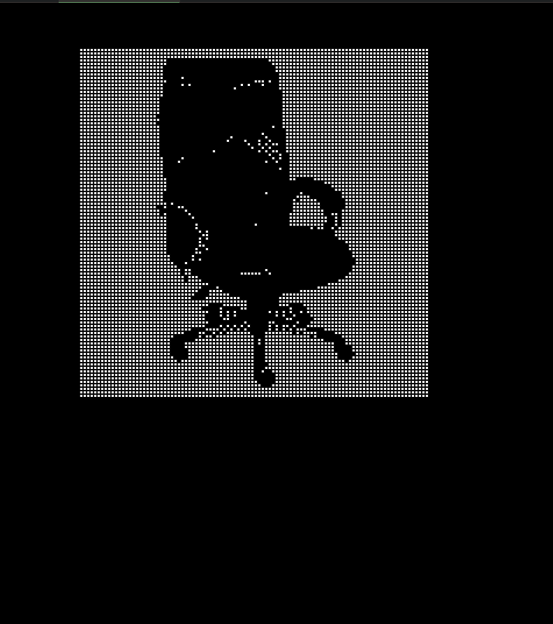
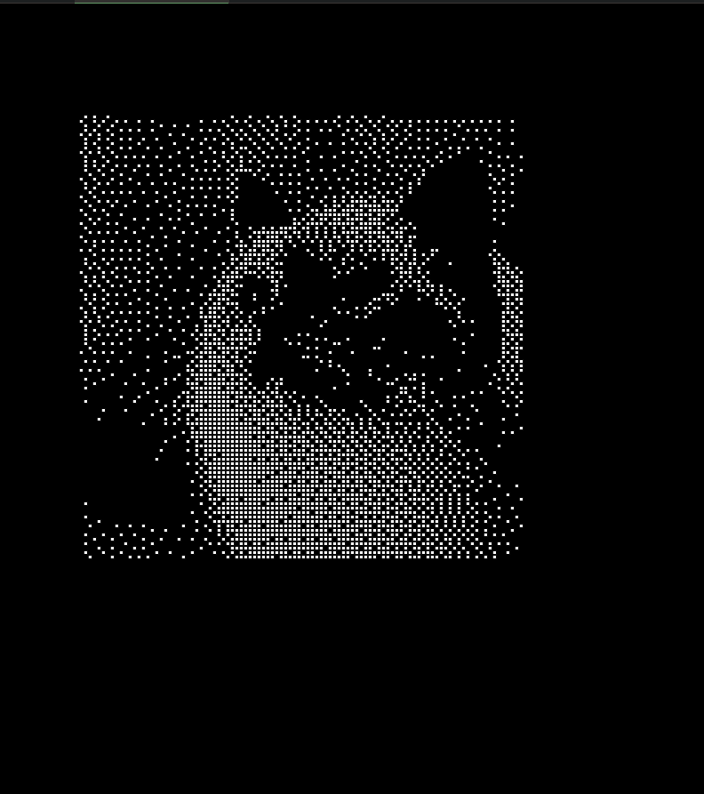
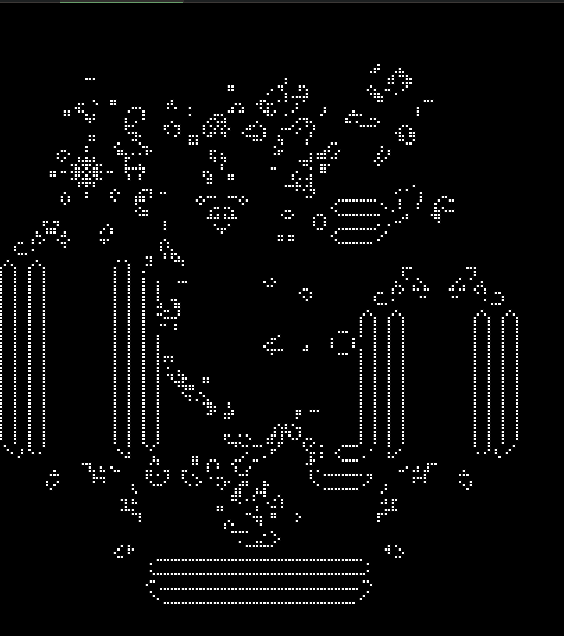

# Conways Game of Life (images as state)

```
1. Takes in image as input and convert to dithered map.
2. Dithered map is used as state (t) and GoL rules are applied to it.
3. The system evolves with anytime, more states could be added by clicks.
```

## Next steps
```
1. Replicate in sytbox.
2. Write a CRON job to fetch latest uploaded file by any active user and perform GoL(image -> dith -> state).
3. Maybe make a GUI to provide upload functionalities.
```

## current results
<video width="640" height="360" controls>
<source src="ss/record_gol.mp4" type="video/mp4">
Your browser does not support the format
</video>



